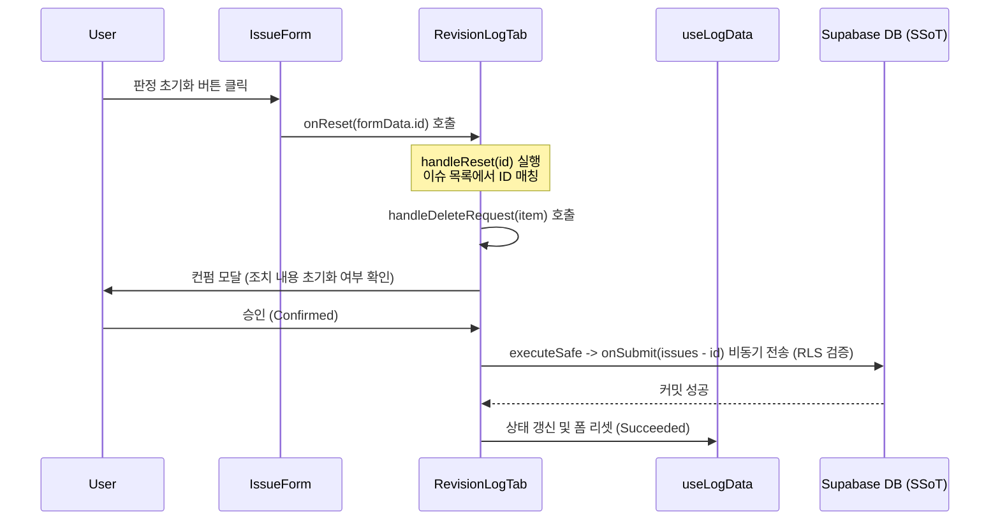

# revision-log-reset-fix - Design Document

> Version: 1.0.0 | Date: 2026-05-19 | Status: Active
> Level: Dynamic | Plan: docs/01-plan/features/revision-log-reset-fix.plan.md

---

## 1. Overview

### 1.1 Purpose
Mitus IP Web의 Revision Log 시스템에서 "판정 초기화" 버튼이 정상 작동하도록 하며, 인터페이스 계약과 데이터 트랜잭션 흐름을 온전히 완결시킵니다.

### 1.2 Design Goals
- `IssueForm`에서 호출하는 `onReset(id)`과 부모인 `RevisionLogTab` 컴포넌트의 데이터 비동기 삭제/초기화(`handleDeleteRequest`) 로직의 완벽한 융합.
- `executeSafe`를 통한 락(Lock) 상태 전파 및 Supabase RLS 준수.
- UI 디자인 및 픽셀 단위의 변화 없이 안정적인 데이터 변경 흐름 보장.

## 2. Architecture

### 2.1 System Architecture

### 2.2 Component Design
- `RevisionLogTab`: Controller 역할을 수행하며, `handleReset` 콜백을 선언하여 `IssueForm`으로 전달.
- `IssueForm`: View/Interaction 역할을 수행하며, 판정 초기화 버튼 클릭 시 주입받은 `onReset`을 트리거함.

### 2.3 Data Flow
- `IssueForm` -> `onReset(id)` -> `handleReset(id)` -> `handleDeleteRequest(item)` -> `onSubmit` -> `ProjectContext` & Supabase.
- DB에 실제로 영구 보존(SSoT)되며, 낙관적 업데이트에 실패하면 Context가 롤백 처리를 지원.

## 3. Data Model

### 3.1 Entities
기존 `issues` 스키마 규격을 100% 준수합니다:
- `entryMode`: `'eval' | 'carryover' | 'reopen' | 'new' | 'fa'`
- `targetIssue`: `[IP Block].[Project].[Issue Num]`
- `assessment` / `comment` / `carryoverAction` / `disposition`

## 4. API Specification

### 4.1 Endpoints
기존 DB API 트랜잭션(`onSubmit`)을 재사용하므로, 신규 엔드포인트는 없습니다.

## 5. Implementation Plan

### 5.1 File Structure
- `src/components/tabs/RevisionLogTab.jsx`
  - `handleReset` 함수를 `handleDeleteRequest` 기반으로 구현
  - `IssueForm`에 `onReset={handleReset}` 바인딩

### 5.2 Implementation Order
1. `RevisionLogTab.jsx`의 `handleReset` 훅 콜백 설계 및 추가.
2. `IssueForm` 인스턴스 컴포넌트에 `onReset={handleReset}` 프롭 전달.
3. 로컬 Playwright 통합/단위 테스트를 통해 초기화 동작의 정상 수행 확인.

## 6. Test Plan

### 6.1 Unit & Integration Tests
- [ ] EVT3 등 평가 차수에서 판정 완료된 카드를 열고 수정 모드 진입.
- [ ] "판정 초기화" 버튼이 보이며, 클릭 시 컨펌 모달 기동 검증.
- [ ] 모달 승인 시, 리스트에서 해당 평가 내역이 정상적으로 삭제되고, 판정대기 상태로 롤백되는지 Supabase DB 및 UI에서 동시 검증.

## 7. Security Considerations

- RLS(Row Level Security) 정책: `onSubmit` API를 재사용하므로 Supabase 세션 토큰 및 소유자 권한 검증이 그대로 유지됩니다.
- 비동기 에러 가드: `executeSafe`를 활용하여 DB 쓰기 실패 시 예외가 안전하게 래핑 및 전파됩니다.
